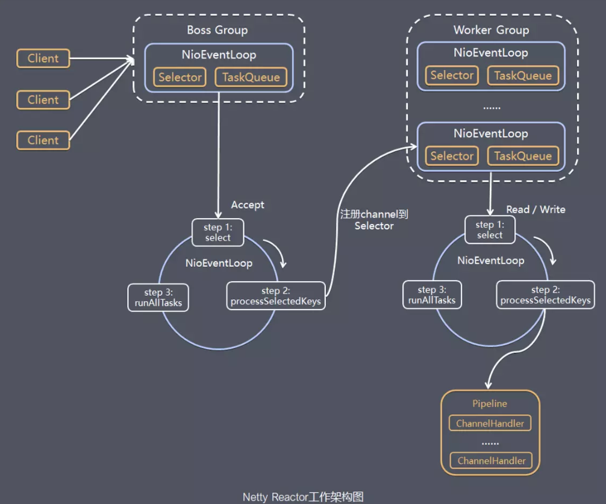

## ABtest

#### 核心原理
- 分流引擎：基于哈希的多层正交分桶，保证随机性和独立
- 层与层之间流量独立，同一流量穿越每层时重新随机打散
- 同层内实验流量不重叠，避免相互干扰
- 总流量
  ├── 域1（互斥）─ 20%流量
  │   └── 独立实验（完全隔离）
  └── 域2（互斥）─ 80%流量
     ├── Layer1（UI层）─ 正交 ─ 80%流量
     │   ├── 实验A1 ─ 40%
     │   └── 实验A2 ─ 40%
     ├── Layer2（算法层）─ 正交 ─ 80%流量
     │   ├── 实验B1 ─ 30%
     │   └── 实验B2 ─ 50%
     └── Layer3（广告层）─ 正交 ─ 80%流量

#### 关键点：
- 使用10000个桶实现0.01%精度控制
- 不同层使用不同seed保证正交性
- MurmurHash3保证均匀分布
  - 
- BossGroup负责接受客户端的连接
- WorkGroup专门负责网络读写
- 类型都是NioEventLoopGroup，包含多个事件循环线程（NioEventLoop）的事件循环线程组
- 每个事件循环线程都是一个selector，用于监听注册在上边的socketchannel的网络通讯
- Boss NioEventLoop：
  - 处理accept事件，与client建立连接，生成NioSocketChannel
  - 将NioSocketChannel注册到work NioEventLoop上的selector
  - 处理任务队列的任务
- work NioEventLoop
  - 轮询注册到selector上的niosocketchannel上的读、写事件
  - 处理io读写事件
  - 处理任务队列的任务
  - 每个work NioEventLoop处理niosocketchannel上的业务时，会使用管道，管道中维护了很多handler处理器来处理channel的数据
#### 长、短链接
- 短连接：数据发送完以后就关闭
- 长连接：发送完业务数据后会发送一些检测数据，保证链接有效存活
